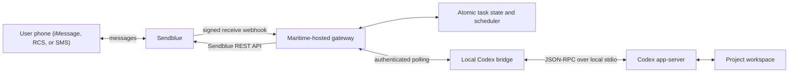

# Architecture

Sendblue only transports messages. The gateway parses the fixed command protocol, owns delivery timing, verifies the webhook secret, allowlists senders, and deduplicates provider message handles. No LLM is involved in that path.

The local bridge owns the app-server connection. The public gateway never connects inbound to the local machine; the bridge polls for deterministic control envelopes and responds only to exact app-server request IDs.

The gateway is authoritative for message timing and idempotency. Codex is authoritative for task plans and execution state. A messaging provider never estimates progress.

## Approval flow

1. App-server sends `item/commandExecution/requestApproval` or `item/fileChange/requestApproval`.
2. The bridge creates one expiring gateway approval.
3. The gateway sends its human-readable reference through Sendblue.
4. An allowlisted sender replies Y or N.
5. Sendblue posts the message to the verified receive webhook.
6. The gateway queues a control envelope tied to the stored approval UUID.
7. The bridge responds `accept` or `decline` to the original JSON-RPC request.

`acceptForSession` is deliberately not exposed over messaging.

## Persistence and wakeups

The MVP uses a single-process JSON store with atomic replacement. It is appropriate for a personal gateway or small team deployment. Use a shared transactional store before running multiple gateway replicas.

The process ticks once per minute while awake. A Maritime cron trigger should also call authenticated `POST /v1/tick` once per minute so scheduled outbound updates wake a sleeping service. Duplicate ticks are safe because each task stores its next due time.
