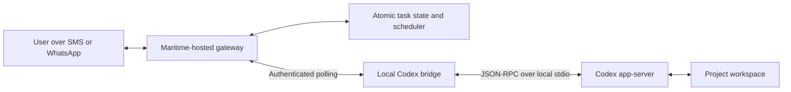

# Architecture

The local bridge owns the app-server connection. Nothing connects inbound to the local machine. It polls the gateway for deterministic control envelopes and responds only to exact app-server request IDs.

The gateway is authoritative for delivery timing and control-message idempotency. Codex is authoritative for task plans and execution state. A messaging runtime never estimates progress itself.

## Approval flow

1. App-server sends `item/commandExecution/requestApproval` or `item/fileChange/requestApproval`.
2. The bridge creates one expiring gateway approval.
3. The gateway sends its human-readable reference.
4. An allowlisted sender replies Y or N.
5. The gateway queues a control envelope tied to the stored approval UUID.
6. The bridge responds `accept` or `decline` to the original JSON-RPC request.

`acceptForSession` is deliberately not exposed over messaging.

## Persistence

The MVP uses a single-process JSON store with atomic file replacement. It is appropriate for a personal gateway or small team deployment. Replace the store interface with Postgres before running multiple gateway replicas.